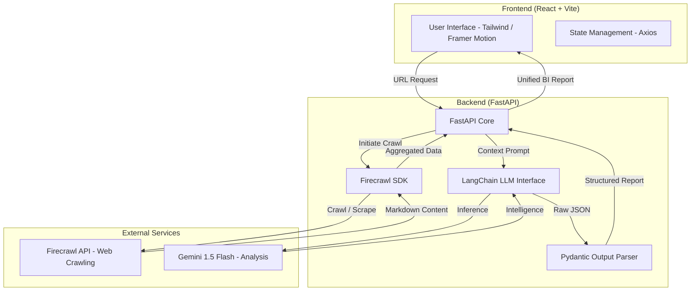

# 🚀 SiteScope AI — Website Analyzer

**SiteScope AI** is a premium **Business Intelligence (BI) tool** that transforms raw website data into **structured, actionable insights**.
By combining **high-speed automated crawling** with **state-of-the-art LLM analysis**, it delivers a **360-degree intelligence view** of any company’s digital presence.

---

## 🧠 What It Does

* Crawls and analyzes multiple pages of a website
* Extracts structured business intelligence using LLMs
* Presents insights in a modern, executive-grade dashboard

Perfect for **founders, analysts, marketers, and consultants** who need quick yet deep website intelligence.

---

## 🏗 Architecture

SiteScope AI follows a **decoupled client–server architecture**, ensuring scalability and clean separation of concerns.




---

## 🔍 Approach & Methodology

### 1️⃣ Multi-Stage Extraction

Instead of analyzing only the homepage, SiteScope AI performs **recursive crawling** (via Firecrawl) and extracts content from up to **10 relevant sub-pages** such as:

* About
* Services
* Policies
* Contact

This provides the LLM with **rich, business-level context**.

---

### 2️⃣ Structured Intelligence

All LLM outputs are validated using **Pydantic-based schemas**, ensuring:

* Reliable
* Predictable
* Machine-readable data

This enables complex insights such as:

* SWOT analysis
* Product & service listings
* SEO and brand intelligence

---

### 3️⃣ “Premium-First” Design

The UI is designed as an **experience**, not just a dashboard.

* Glassmorphism design system
* Smooth animations via **Framer Motion**
* Executive-friendly data presentation

---

## ✨ Features

* 🔎 **Deep Crawling** — Analyze up to 10 sub-pages per website
* 📊 **Strategic Analysis** — Detailed SWOT (Strengths, Weaknesses, Opportunities, Threats)
* 🔍 **SEO Insights** — Meta tags and primary keyword extraction
* 🎯 **Brand Analysis** — Voice, tone, and uniqueness detection
* 💎 **Modern Dashboard** — Glassmorphism UI with smooth animations

---

## 🛠 Tech Stack

### Backend

* **FastAPI** — High-performance Python API framework
* **Firecrawl** — Advanced web crawler optimized for LLM workflows
* **Google Gemini 1.5 Flash** — LLM for fast business analysis
* **LangChain & Pydantic** — AI orchestration and structured output

### Frontend

* **React (Vite)** — Fast frontend tooling
* **Tailwind CSS** — Modern styling
* **Framer Motion** — Smooth UI animations
* **Lucide React** — Premium iconography

---

## 🚀 Getting Started

### ✅ Prerequisites

* Python **3.10+**
* Node.js **18+**
* [Firecrawl API Key](https://firecrawl.dev)
* [Gemini API Key](https://aistudio.google.com)

---

## 📦 Installation

### 1️⃣ Clone the Repository

```bash
git clone https://github.com/raswanthappu/Website-Analyzer.git
cd Website-Analyzer
```

---

### 2️⃣ Backend Setup

```bash
cd backend
python -m venv venv
source venv/bin/activate   # Windows: venv\Scripts\activate
pip install -r requirements.txt
```

Create a `.env` file inside the `backend` folder:

```env
FIRECRAWL_API_KEY=your_firecrawl_key
GEMINI_API_KEY=your_gemini_key
PORT=8000
```

---

### 3️⃣ Frontend Setup

```bash
cd ../frontend
npm install
```

---

## ▶️ Running the Application

### Start Backend

```bash
cd backend
source venv/bin/activate
python main.py
```

### Start Frontend

```bash
cd frontend
npm run dev
```

Open your browser at:
👉 **[http://localhost:5173](http://localhost:5173)**

---

## 📄 License

MIT License

---
